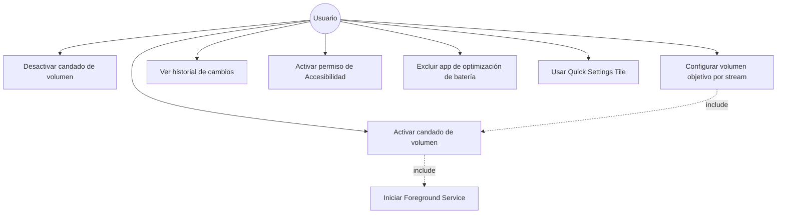
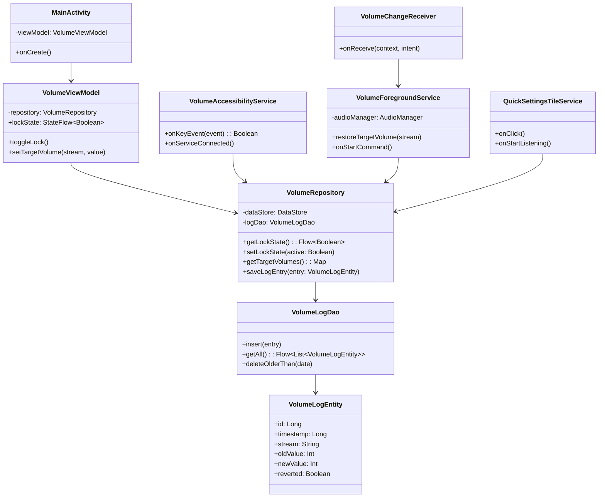
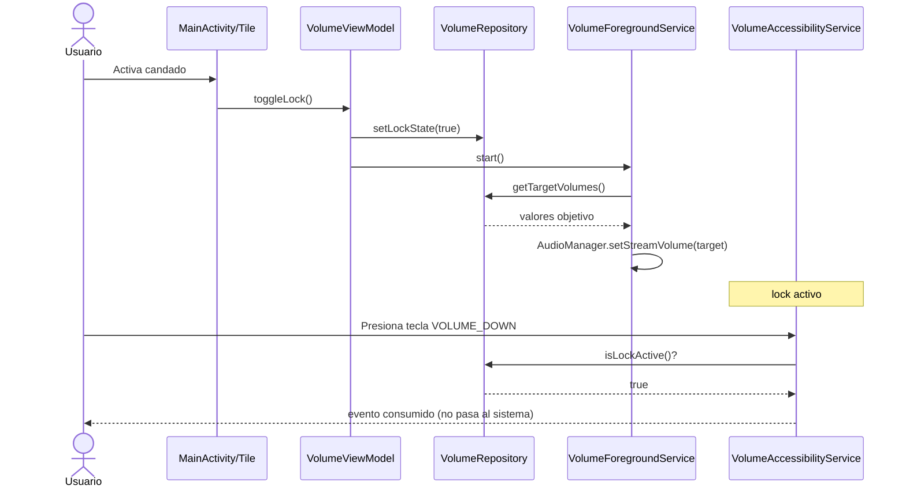
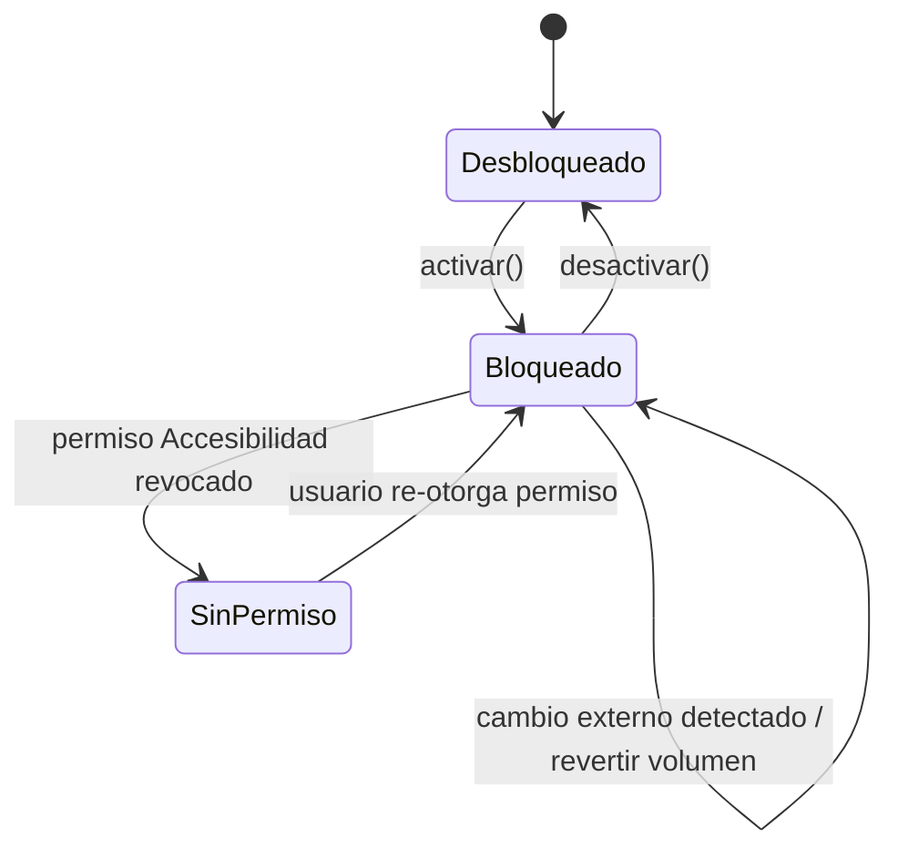

# VolumeLock — Especificación de Proyecto

App Android nativa (uso personal) para bloquear/proteger el volumen ante cambios no deseados, en modo **híbrido** (el usuario activa/desactiva el candado cuando quiere).

---

## 1. Decisión técnica clave (léela antes de todo)

Android **no permite interceptar globalmente** las teclas físicas de volumen solo con un `Service` normal ni con `KeyEvent` en una Activity (eso solo funciona si tu Activity tiene el foco, o sea, mientras usas otra app no sirve).

Las dos formas reales de lograr esto sin root:

1. **AccessibilityService** con `filterKeyEvents = true` → puede consumir (`onKeyEvent` → `return true`) las pulsaciones de `KEYCODE_VOLUME_UP` / `KEYCODE_VOLUME_DOWN` **sistema-wide**, incluso con otras apps abiertas. Esta es la técnica que usan apps reales tipo "Volume Lock" / "AntiMute". Requiere que el usuario active manualmente el permiso de Accesibilidad (no se puede pedir por diálogo estándar).
2. **BroadcastReceiver** de `android.media.VOLUME_CHANGED_ACTION` → no bloquea la pulsación, pero te avisa apenas el volumen cambió, permitiendo revertirlo con `AudioManager.setStreamVolume()` casi instantáneo (útil como capa de respaldo/logging, y para el modo "detectar y revertir").

**Recomendación:** combinar ambas. AccessibilityService como bloqueo duro (modo lock ON = consume las teclas), y el BroadcastReceiver como red de seguridad + fuente de datos para el log de diagnóstico (para pillar qué proceso/app te está bajando el volumen solo).

---

## 2. Historias de usuario

| # | Historia |
|---|----------|
| HU01 | Como usuario, quiero activar un "candado de volumen" para que ni el botón físico ni otra app puedan cambiar el volumen mientras esté activo. |
| HU02 | Como usuario, quiero desactivar el candado en cualquier momento para ajustar el volumen normalmente. |
| HU03 | Como usuario, quiero un Quick Settings Tile (el desplegable de arriba) para activar/desactivar el candado sin abrir la app. |
| HU04 | Como usuario, quiero una notificación persistente que me confirme si el candado está activo o no. |
| HU05 | Como usuario, quiero elegir el volumen "objetivo" (música, llamada, notificación) que se mantiene fijo cuando el candado está activo. |
| HU06 | Como usuario, quiero ver un historial/log de los cambios de volumen detectados (hora, valor anterior, valor nuevo) para diagnosticar si es un bug del sistema o una app específica. |
| HU07 | Como usuario, quiero que la app siga funcionando tras reiniciar el celular, si yo lo configuré así. |
| HU08 | Como usuario, quiero que la app me guíe para activar el permiso de Accesibilidad la primera vez (porque Android no deja pedirlo directo). |
| HU09 | Como usuario, quiero que la app me avise (batería) que debe estar excluida del ahorro de batería para no ser matada por el sistema. |

---

## 3. Requerimientos Funcionales (RF)

- **RF01** — La app debe implementar un `AccessibilityService` que consuma (`return true`) los eventos `KEYCODE_VOLUME_UP` y `KEYCODE_VOLUME_DOWN` únicamente cuando el modo lock esté activo.
- **RF02** — La app debe permitir activar/desactivar el lock desde: (a) la pantalla principal, (b) un Quick Settings Tile.
- **RF03** — Cuando el lock esté activo, si se detecta un cambio de volumen vía `VOLUME_CHANGED_ACTION` que no vino de la propia app, se debe restaurar el valor objetivo automáticamente.
- **RF04** — La app debe correr un Foreground Service (con notificación obligatoria, Android 8+) mientras el lock esté activo.
- **RF05** — La app debe permitir configurar el volumen objetivo por stream (`STREAM_MUSIC`, `STREAM_RING`, `STREAM_NOTIFICATION`, `STREAM_ALARM`) de forma independiente.
- **RF06** — La app debe guardar un log local (Room DB) de cada evento de cambio de volumen: timestamp, stream afectado, valor anterior, valor nuevo, si fue revertido o no.
- **RF07** — La app debe mostrar una pantalla de historial/log filtrable por fecha.
- **RF08** — La app debe detectar si el permiso de Accesibilidad no está concedido y guiar al usuario a Ajustes.
- **RF09** — La app debe ofrecer (opcional) reactivarse tras `BOOT_COMPLETED` si el usuario lo configuró.
- **RF10** — La app debe detectar si está en la whitelist de optimización de batería y, si no, guiar al usuario a desactivarla para esa app.

---

## 4. Requerimientos No Funcionales (RNF)

- **RNF01** — Min SDK 26 (Android 8.0), target al SDK más reciente estable (35 al día de hoy).
- **RNF02** — No requiere root.
- **RNF03** — Bajo consumo: nada de polling; todo basado en eventos (`AccessibilityService` + `BroadcastReceiver`).
- **RNF04** — Arquitectura MVVM, separación clara entre capa de UI, dominio (lógica de audio) y datos (Room/DataStore).
- **RNF05** — Persistencia de logs con límite/rotación (ej. máx. 30 días o 5000 registros) para no crecer indefinidamente.
- **RNF06** — UI en español, Material Design 3, mínimo esfuerzo cognitivo (toggle grande, estado claro).
- **RNF07** — Código modular y testeable (inyección de dependencias simple, sin necesidad de framework pesado dado que es 1 sola app personal).
- **RNF08** — Manejo explícito de permisos especiales (Accesibilidad, Ignorar optimización de batería, Notificaciones en Android 13+).

---

## 5. Diagramas UML

### 5.1 Casos de uso

### 5.2 Diagrama de clases

### 5.3 Secuencia — activar el candado y bloquear una pulsación

### 5.4 Estados del candado

---

## 6. Stack de trabajo (Android nativo, uso personal)

| Capa | Tecnología | Motivo |
|---|---|---|
| Lenguaje | Kotlin | Control total sobre `AudioManager`, `AccessibilityService`; es lo que pediste. |
| UI | Jetpack Compose + Material 3 | Estándar actual, menos boilerplate que XML. *(asumo esto, avísame si prefieres XML/ViewBinding)* |
| Arquitectura | MVVM + `StateFlow` | Simple, oficial de Google, suficiente para una app personal de este tamaño. |
| Persistencia config | Jetpack DataStore (Preferences) | Reemplazo moderno de SharedPreferences, async por defecto. |
| Persistencia logs | Room | Necesitas queries/filtros sobre el historial de cambios (RF06/RF07). |
| Concurrencia | Kotlin Coroutines + Flow | Integra directo con DataStore, Room y Compose. |
| Servicios en background | `AccessibilityService` + `ForegroundService` + `BroadcastReceiver` | Ver sección 1 (decisión técnica clave). |
| Quick Settings | `TileService` (Android Quick Settings API) | Para HU03/RF02. |
| Build | Gradle (Kotlin DSL) | Estándar Android Studio actual. |
| Testing | JUnit5 + Turbine (para Flow) + Espresso (UI básica) | Cobertura mínima razonable sin sobre-ingeniería para proyecto personal. |
| Distribución | APK firmado, instalado por sideload (`adb install` o directo) | Confirmaste que es solo para tu celular, no Play Store. |

### Permisos que vas a necesitar declarar/gestionar

- `BIND_ACCESSIBILITY_SERVICE` (vía config de Accesibilidad, no es permiso normal en manifest del mismo modo)
- `FOREGROUND_SERVICE` y `FOREGROUND_SERVICE_MEDIA_PLAYBACK` o similar (según versión Android)
- `POST_NOTIFICATIONS` (Android 13+)
- `RECEIVE_BOOT_COMPLETED` (si activas HU07)
- Ignorar optimización de batería: se pide vía intent (`ACTION_REQUEST_IGNORE_BATTERY_OPTIMIZATIONS`), no permiso manifest.

---

## 7. Siguiente paso sugerido

Con esto ya podríamos partir por: (1) armar el proyecto base en Android Studio con la estructura de paquetes, o (2) partir directo por el `AccessibilityService` que es la pieza más riesgosa/incierta del proyecto (conviene validarla primero antes de construir todo el resto encima).
